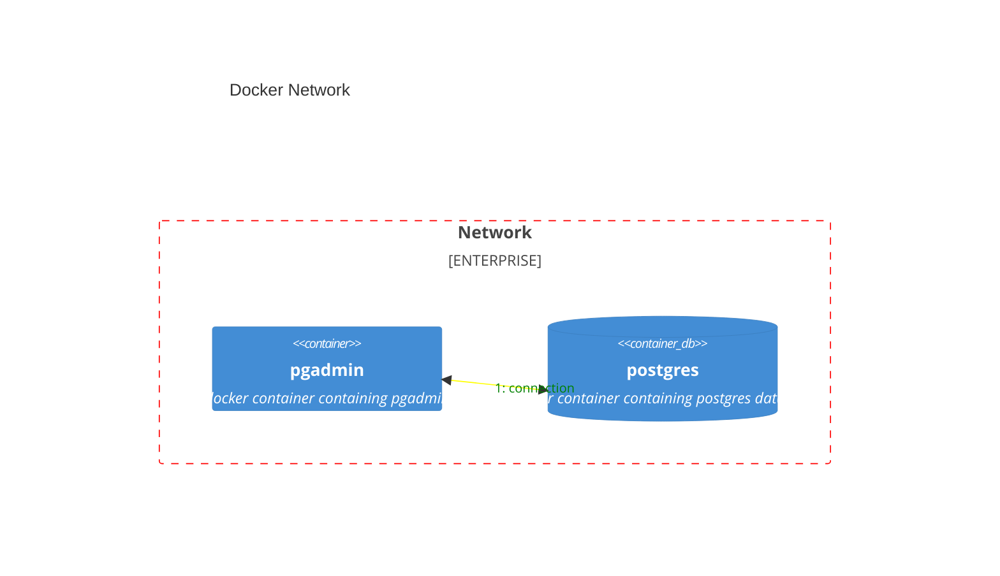

To download the container of pgadmin, you can find it here.

[PgAdmin docker hub](https://hub.docker.com/r/dpage/pgadmin4/)

## Setup

```shell
docker run -it \
 -d \
 --name pgadmin_container \
 -e PGADMIN_DEFAULT_EMAIL="admin@admin.com" \
 -e PGADMIN_DEFAULT_PASSWORD="root" \
 -p 8080:80 \
 dpage/pgadmin4
```

This will now download the pgadmin if it is not available

It will set the default env values and the port to 8080

Compared to the tutorial, added a name to the docker and set it to detached mode.


---

## Add New server

Now upon login, we must do add new server.

But first we must ensure that the postgres container is also running.

Upon adding the usual user and password, you'll be greeted with this error


This is because pgadmin is trying to find the postgres database inside its own container via
localhost ip but the postgres database is on another container.

To resolve this error, we must somehow link the two containers containing
pgadmin and postgres database each.

---

## Linking two containers



### Create Network

To do the linking of the two containers we must use `docker network`

[Docker Network Create](https://docs.docker.com/engine/reference/commandline/network_create/)

To create docker network

```shell
docker network create pg-network
```

To check the created network, run the following command

```shell
docker network ls
```


---

### Connecting to the network

[Connect Network Reference](https://docs.docker.com/engine/reference/commandline/network_create/#examples)

Now we must modify the commands to enable adding to the network

`--network=pg-network`

We must add this new variable with the name of the network to instruct
the postgres to connect with

```shell
docker run -d \
  --name postgres_container \
  -it \
  -e POSTGRES_USER="root" \
  -e POSTGRES_PASSWORD="root" \
  -e POSTGRES_DB="ny_taxi" \
  -v $(pwd)/ny_taxi_postgres_data:/var/lib/postgresql/data \
  -p 5432:5432 \
  --network=pg-network \
  postgres:13

sudo chmod a+rwx ny_taxi_postgres_data
```

```shell
docker run -it \
 -d \
 --name pgadmin_container \
 -e PGADMIN_DEFAULT_EMAIL="admin@admin.com" \
 -e PGADMIN_DEFAULT_PASSWORD="root" \
 -p 8080:80 \
 --network=pg-network \
 dpage/pgadmin4
```

---

#### Docker run error

Unlike in the course materials, we have already given a name to the container.
So when running the same commands, this will result in this error


~~In order to resolve for this, we must use `docker start` instead of `docker run`~~

~~[Reference](https://www.baeldung.com/ops/docker-name-already-in-use#restarting_container)~~

Was unable to use the [docker start](https://docs.docker.com/engine/reference/commandline/start/) to resume with the
container with new variables

In exchange, according to
the [documents](https://docs.docker.com/engine/reference/commandline/network_connect/#examples)

We can use the `docker network connect` to connect already running containers to the network

```shell
docker network connect pg-network pgadmin_container
docker network connect pg-network postgres_container
```

To check if the data are still there, but we did connect the container with the linux so the data should be preserved.

```shell
pgcli -h localhost -p 5432 -u root -d ny_taxi
```


---

### Connecting to the network from two separate containers

Now that they're connected to the same network. Perform the steps to creating a new server

But instead of using `localhost`, we must use the name of the container `postgres_container`


And now it is a success connecting the two containers via `docker network`

---

| Return to table of contents | Next page                                                                             |
|-----------------------------|---------------------------------------------------------------------------------------|
| [Readme.md](README.md)      | [Putting the ingestion script into Docker](1.2.4_Dockerizing_the_Ingestion_Script.md) |