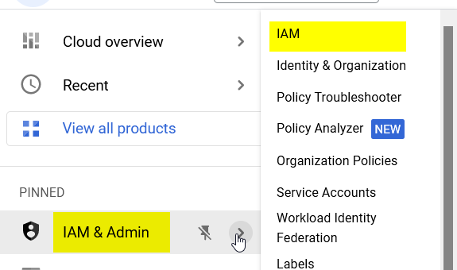
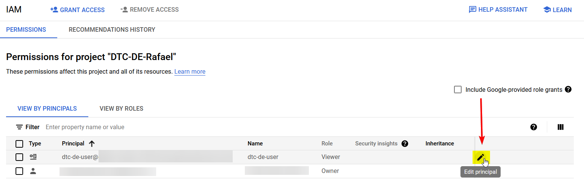
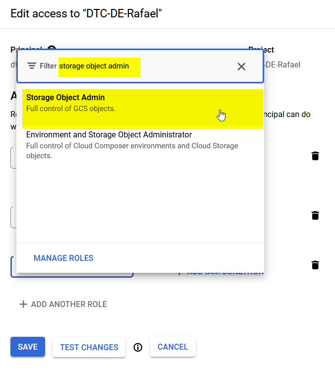
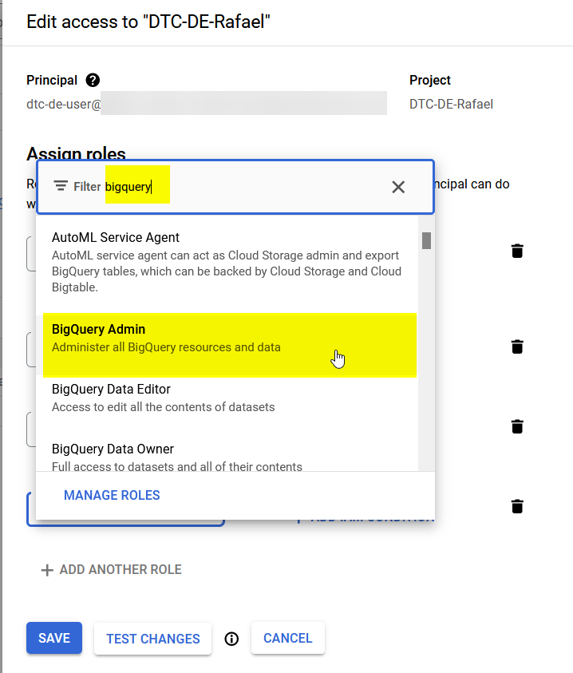
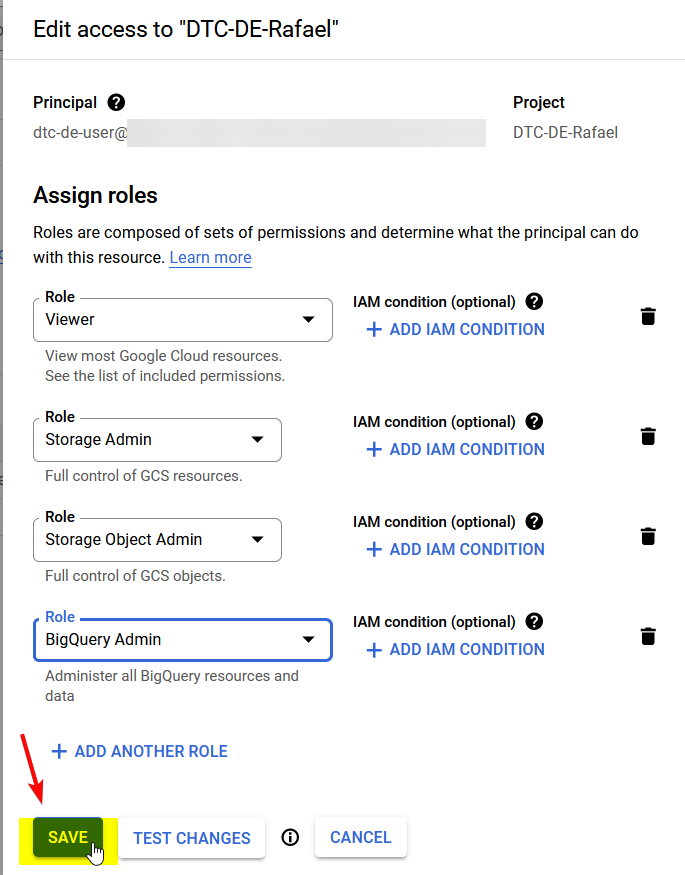
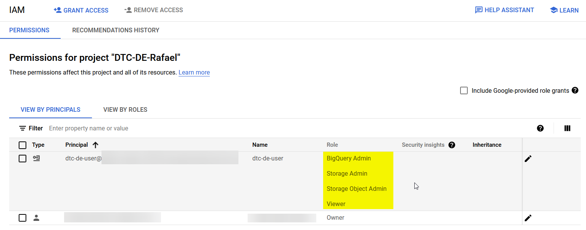
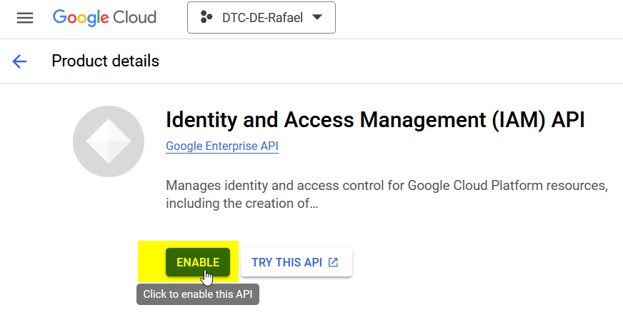
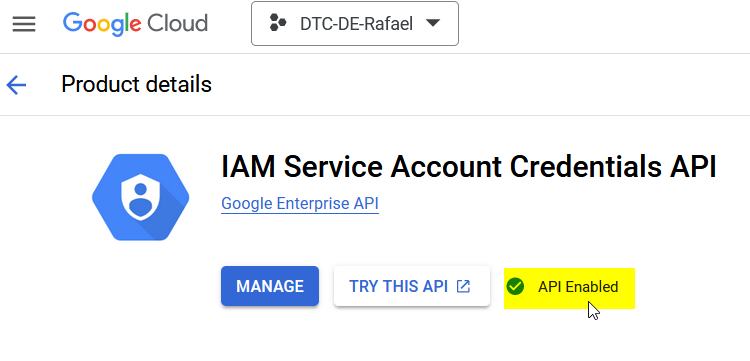

# Local Setup of Terraform and GCP

1. [Terraform Setup](#terraform-setup)
   1. [WSL](#wsl)
   2. [MacOS](#macos)

2. [GCP setup](#gcp-setup)
    1. [GCP setup service account and authentication](#gcp-setup-service-account-and-authentication)
    2. [Setup GCP CLI](#setup-gcp-cli)
    3. [Alternate setup](#alternate-setup)
    4. [Setup access](#setup-access)
        1. [Setup permission roles for the GCP user account](#setup-permission-roles-for-the-gcp-user-account)
        2. [Enable APIs for the project](#enable-apis-for-the-project)
      
3. [Pages](#pages)

---

## Terraform Setup

### WSL

1. Get the unzip module
   ```shell
   sudo apt install wget unzip
   ```
2. Go to the website to get the link to download
    1. https://developer.hashicorp.com/terraform/downloads
    2. Navigate to Linux tab
    3. Right-click on the `AMD64` Download to get the download link
       

3. Download the file and then renamed it.
   ```shell
   cd ~
   wget https://releases.hashicorp.com/terraform/1.3.7/terraform_1.3.7_linux_amd64.zip -O terraform.zip
   ```

4. Unzip the file and then moved it to the `/usr/local/bin`
   ```shell
   unzip terraform.zip
   sudo mv terraform /usr/local/bin
   ```
   
5. Confirm if the Terraform is working properly.
   ```shell
   terraform -v
   ```
   

### MacOS

```shell
brew tap hashicorp/tap
brew install hashicorp/tap/terraform
```

---

## GCP setup

### GCP setup service account and authentication

After the account creation, this is the steps we must do


1. Create a project on GCP, and after the creation select that project to switch into that project.

   

   The `Project ID` must be unique to all of GCP

   

   Then wait for the notification that indicates that the project have been created.

   

2. Now click the hamburger button on the left side, and then click `IAM`

   

3. Now click the `Service Accounts`, and then select `Create Service Account`.

   `Service account` is a special kind of account used by an application or compute workload, such as a Compute Engine
   virtual machine (VM) instance, rather than a person. A service account is identified by its email address, which is
   unique to the account.

   

   
4. Now we need to fill up the details for the `Service Account`. This doesn't need to be unique id because this in
   combination with email of your project will make it unique.

   

5. Now, next step is to give it a `viewer` role. But this is only at the beginning.

   
6. Next up, this part is useful for the production environment if you want multiple user associated with the same level
   of permission. But for this course we will skip this part. Now we must click `done`

   
7. Now that the service is account is created, you can see that there is no keys in there. To create key go to
   the `Actions Kehab menu` and then select `Manage Keys`

   

8. Select the `Add Key` and then select `Create new key`.

   

   Then select the `JSON` so we can read the file and possibly edit the file, and then select `create key`

   

   After the key was created, it will then be saved into your local computer. We must keep this key.

   

---

### Setup GCP CLI

To set up the GCP CLI we must follow the steps.

1. Go to this website https://cloud.google.com/sdk/docs/install#linux

2. Now do the following shell commands.

   Download the file
   ```shell
   curl -O https://dl.google.com/dl/cloudsdk/channels/rapid/downloads/google-cloud-cli-415.0.0-linux-x86_64.tar.gz
   ```

   Extrac the file.
   ```shell
   tar -xf google-cloud-cli-415.0.0-linux-x86_64.tar.gz
   ```

   Now run the installation shell
   ```shell
   ./google-cloud-sdk/install.sh
   ```

3. Check if it is installed properly by running
   ```shell
   gcloud -v
   ```

   

4. Now we must log in our account by running this following command.
   ```shell
   ./google-cloud-sdk/bin/gcloud init
   ```

5. Now you must proceed to log in.

   

   Afterwards you will be prompted to log in using the link given.

   

6. Copy-paste the link to the browser, and then click your own account with the GCP.

   

   Now we must give the CLI the permission to the account.

   

7. Now we will be redirected to the page, where we will copy the verification code.

   

8. Paste the verification code to the terminal, and then wait for it to log in. After the login, select the project ID

   

9. Afterwards, your GCP CLI is now connected to your google account and the project.

### Alternate setup.

1. Locate the `JSON` file from the `Service account` and then export it to the path.
   ```shell
   export GOOGLE_APPLICATION_CREDENTIALS=/home/rafael/<KEY-FROM-SERVICE-ACCOUNT>.json
   ```

2. Then proceed to log in with this command.
   ```shell
   gcloud auth application-default login
   ```

3. Repeat from the step 6 above.

---

### Setup access

#### Setup permission roles for the GCP user account

On the next step, we now need to create a **Google Cloud Storage**: Data Lake and **BigQuery**: Data Warehouse

**Cloud Storage** is like a bucket in GCP where we can store files as objects.

**BigQuery** is the Data warehouse equivalent in GCP

---

Now that the local is already authenticated with the cloud environment we now need to add permissions for the servce
account

1. Go to IAM, find the created user and then select the `Edit Principal`

   

   

   In this course, the permissions will be kept simple, but it is not advisable for the production environment.

2. In order to add permissions for the Google Cloud Storage
    1. Click the `ADD ANOTHER ROLE`

       
    2. In order to control over Google Cloud Storage bucket, we will need `Storage Admin`

       This role will give us the permission to create buckets

       With `Admin` we are giving ownership level permission.

       But in production we need to set it to a particular bucket.

       

    3. We also need `Storage Cloud admin` to control Google Cloud Storage objects.

       

3. In order to add permissions for the BigQuery
    1. Repeat the steps of `ADD ANOTHER ROLE`
    2. Add the `BigQuery Admin`, although in real production we need to step up a more granular permission.
       

4. Once all the steps are done, hit the `Save` button.

   

5. And now you can see that you successfully added all the permissions.

   

---

#### Enable APIs for the project

When the local environment interacts with the cloud environment, it doesn't really interact with the resources, but it
interacts with the resources via the APIs.

And when we enable APIs, we must make sure that the right project from the drop-down is the one we enabled because
sometimes we must have multiple projects.

- https://console.cloud.google.com/apis/library/iam.googleapis.com

  

- https://console.cloud.google.com/apis/library/iamcredentials.googleapis.com

  

And now with all the steps done, we can now begin with the terraform part.

---

## Pages

| Previous Page                           | Return to table of contents | Next page                                                                                         |
|-----------------------------------------|-----------------------------|---------------------------------------------------------------------------------------------------|
| [SQL Refresher](1_2_6_SQL_refresher.md) | [Readme.md](README.md)      | [Creating GCP Infrastructure with Terraform](1_3_2_Creating_GCP_Infrastructure_with_Terraform.md) |